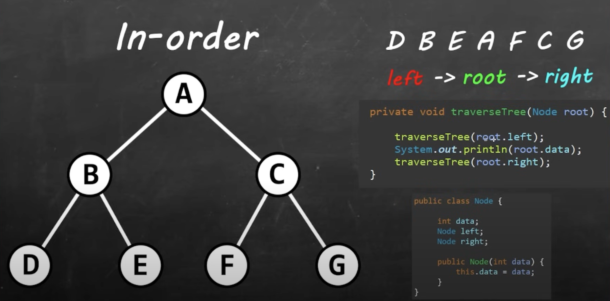
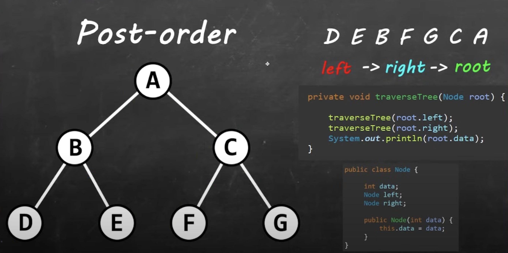

# DSA-Notes
  This repository contains notes and example code based on what I learned from the Bro Code [Data Structures and Algorithms Course](https://www.youtube.com/watch?v=CBYHwZcbD-s). It covers fundamental DSA concepts, algorithmic strategies, and practical coding examples.

## Table of Contents
  1. [What is a Data Structure?](#what-is-a-data-structure)
  2. [What is an Algorithm?](#what-is-an-algorithm)
  3. [Why Should You Learn Data Structures and Algorithms?](#why-should-you-learn-data-structures-and-algorithms)
  4. [Stacks](#stacks)
  5. [Queues](#queues)
  6. [Priority Queues (Heaps)](#priority-queues-heaps)
  7. [Linked Lists](#linked-lists)
  8. [Dynamic Arrays](#dynamic-arrays)
  9. [Big O Notation](#big-o-notation)
  10. [Linear Search](#linear-search)
  11. [Binary Search](#binary-search)
  12. [Interpolation Search](#interpolation-search)
  13. [Bubble Sort](#bubble-sort)
  14. [Selection Sort](#selection-sort)
  15. [Insertion Sort](#insertion-sort)
  16. [Recursion](#recursion)
  17. [Merge Sort](#merge-sort)
  18. [Quick Sort](#quick-sort)
  19. [Hash Tables](#hash-tables)
  20. [Graphs](#graphs)
  21. [Depth First Search](#depth-first-search)
  22. [Breadth First Search](#breadth-first-search)
  23. [Trees](#trees)
  24. [Resources](#resources)
  
## What is a Data Structure?

  A **data structure** is a way of organizing and storing data so that it can be accessed and modified efficiently. Different types of data structures are designed to suit different kinds of operations and performance requirements, making them fundamental to computer science and software development.

  <ins>Common Types of Data Structures</ins>
    
  1. Array:
  - Description: A collection of elements, typically of the same type, stored in contiguous memory locations.
  - Example: `int[] numbers = {1, 2, 3, 4, 5};`
  - Use case: Good for accessing elements by index, such as in lists of numbers or objects.

  2. Linked List:
  - Description: A sequence of nodes where each node contains data and a reference (or link) to the next node.
  - Example:
    ```
    class Node {
      constructor(data) {
        this.data = data;
        this.next = null;
      }
    }
    ```
  - Use case: Useful for dynamic memory allocation and efficient insertion/deletion operations, like in queues or stacks.

  3. Stack:
  - Description: A collection of elements that follows the Last In, First Out (LIFO) principle.
  - Example: Imagine a stack of plates where the last one added is the first one to be removed.
  - Use case: Useful in recursion, undo operations, or browser history navigation.

  4. Queue:
  - Description: A collection of elements that follows the First In, First Out -(FIFO) principle.
  - Example: A line of people waiting for service where the first person in line is served first.
  - Use case: Task scheduling or handling requests in order.

  5. Hash Map (Hash Table):
  - Description: A collection of key-value pairs, where each key is unique, and a hash function is used to compute an index in an array to store the value.
  - Example: { "name": "John", "age": 30 } in JSON or a dictionary in Python.
  - Use case: Efficient lookups by key, like storing user data by their ID.

  6. Tree:
  - Description: A hierarchical structure with a root node and child nodes, where each node can have multiple children.
  - Example: A file system structure where directories can have subdirectories.
  - Use case: Searching and sorting algorithms, hierarchical data representation.

  7. Graph:
  - Description: A collection of nodes (vertices) and edges connecting them, representing relationships between pairs of objects.
  - Example: Social networks where users are nodes and friendships are edges.
  - Use case: Modeling networks, paths, and connections like web pages and links.

  <ins>Why Data Structures Matter</ins>

  The choice of data structure affects the efficiency of algorithms. For instance, a linked list is more efficient for frequent insertions and deletions compared to an array, while an array is better for random access.

## What is an Algorithm?

  An **algorithm** is a step-by-step procedure or set of rules used to solve a specific problem or perform a task. It is a sequence of instructions that can be executed to produce a desired outcome. Algorithms are widely used in computer programming, mathematics, and everyday problem-solving.

  <ins>Examples of Algorithms:</ins>

  1. Binary Search Algorithm:
  - Problem: Find an element in a sorted array.
  - Algorithm:
    1. Start with the middle element of the array.
    2. If the middle element is the target, return its index.
    3. If the middle element is greater than the target, repeat the process on the left half of the array.
    4. If the middle element is smaller, repeat the process on the right half of the array.
    5. Continue this process until the element is found or the array is exhausted.
  - Use Case: Searching for a name in a sorted list of contacts.

  2. Bubble Sort Algorithm:
  - Problem: Sort an array of numbers in ascending order.
  - Algorithm:
    1. Start from the first element of the array.
    2. Compare the current element with the next element.
    3. If the current element is greater than the next, swap them.
    4. Move to the next pair and repeat.
    5. After each pass through the array, the largest element moves to the end.
    6. Continue until the array is sorted.
  - Use Case: Organizing a list of students' grades from lowest to highest.

  3. Euclidean Algorithm:
  - Problem: Find the greatest common divisor (GCD) of two numbers.
  - Algorithm:
    1. Divide the larger number by the smaller one.
    2. Take the remainder and replace the larger number with it.
    3. Repeat the process until the remainder is zero.
    4. The non-zero divisor at that point is the GCD.
  - Use Case: Simplifying fractions.

  4. Dijkstra’s Algorithm:
  - Problem: Find the shortest path between two nodes in a graph.
  - Algorithm:
    1. Set the starting node’s distance to zero and all other nodes' distances to infinity.
    2. Select the unvisited node with the smallest distance.
    3. Update the distances of its neighboring nodes.
    4. Repeat the process until all nodes have been visited or the shortest path to the target node is found.
  - Use Case: Finding the shortest driving route between two cities on a map.

  These examples illustrate how algorithms are designed to solve specific problems efficiently. Each step in an algorithm is clearly defined to ensure it can be followed systematically. 

## Why Should You Learn Data Structures and Algorithms?

  Learning Data Structures and Algorithms (DSA) is crucial for several reasons:

  1. Problem-Solving Skills: DSA teaches how to break down complex problems and solve them efficiently. It enhances logical thinking and helps in developing optimal solutions.
  2. Efficient Coding: Algorithms and data structures provide a foundation for writing code that runs faster and uses fewer resources. This is vital in real-world applications where performance matters.
  3. Technical Interviews: Many software engineering interviews focus on DSA. Mastering these concepts is essential for landing a job in top tech companies, as they evaluate problem-solving skills through DSA-related questions.
  4. Building Scalable Systems: When designing large systems, understanding how different data structures and algorithms behave in terms of time and space complexity helps in making better architectural decisions.
  5. Versatility: DSA knowledge applies across various domains, including web development, mobile applications, artificial intelligence, and game development, making you a more versatile developer.
  6. Foundation for Advanced Topics: Concepts in DSA form the basis for learning more advanced topics like machine learning, cryptography, and database management.

  In short, DSA equips you with the skills to solve complex problems efficiently, crucial for both technical growth and career progression.

## Stacks

  <ins>Comprehensive Overview of the Stack Data Structure</ins>

  A **Stack** is a linear data structure that follows the Last In, First Out (LIFO) principle. This means that the last element added to the stack is the first one to be removed. It's similar to a stack of plates—only the top plate can be removed, and new plates are added to the top.

  <ins>Key Operations</ins>

  1. Push: Add an element to the top of the stack.
  2. Pop: Remove and return the element from the top of the stack.
  3. Peek (or Top): Retrieve the top element without removing it.
  4. IsEmpty: Check whether the stack is empty.
  5. Size: Return the number of elements in the stack.

  Stacks can be implemented using arrays, linked lists, or dynamic data structures like lists in high-level programming languages.

  <ins>Applications of Stacks</ins>

  1. Function Call Management: Programming languages use stacks to manage function calls and local variables in recursive functions. Each call is pushed onto the call stack, and when the function returns, it's popped off the stack.
  2. Expression Evaluation and Syntax Parsing: Stacks are used to evaluate expressions, including converting infix expressions to postfix (Reverse Polish Notation) or prefix. Parsing expressions in compilers also relies on stacks.
  3. Undo Mechanism: In text editors, stacks store previous actions so that undoing them can be done in reverse order of their execution.
  4. Balanced Parentheses Problem: Stacks are commonly used to check whether parentheses in expressions are balanced.
  5. Browser History: The back/forward navigation buttons in browsers use stacks to manage visited web pages.

  <ins>Stack Operations in Python Example</ins>
  
  Consider a stack that holds integers:
  ```
  stack = []
  ```

  1. Push Operation: Adding an element to the top of the stack:
      ```
      stack.append(10)  # Stack: [10]
      stack.append(20)  # Stack: [10, 20]
      ```
  2. Pop Operation: Removing the top element from the stack:
      ```
      top_element = stack.pop()  # Removes 20; Stack: [10]
      ```
  3. Peek Operation: Retrieving the top element without removing it:
      ```
      top_element = stack[-1]  # Retrieves 10 without removing
      ```
  4. IsEmpty Operation: Checking if the stack is empty:
      ```
      is_empty = len(stack) == 0  # False, since the stack is not empty
      ```
  5. Size Operation: Checking the size of the stack:
      ```
      size = len(stack)  # 1, since there is one element (10)
      ```
  
  Python uses lists as dynamic arrays to implement a stack.

  <ins>Advantages of Stacks</ins>

  1. Simple to Implement: Stacks are relatively easy to implement and manage.
  2. Efficient Operations: Push and pop operations run in constant time, O(1).

  <ins>Disadvantages of Stacks</ins>

  1. Limited Access: Elements can only be accessed from the top, making it inefficient for accessing elements deep within the stack.
  2. Fixed Size (in Array Implementation): When implemented using arrays, stacks may run into size limitations unless a dynamic resizing mechanism is used.

  <ins>Stack Implementations</ins>

  1. Array-Based Stack: Easy to implement but requires predefined size or dynamic resizing.
  2. Linked List-Based Stack: More flexible since it can grow dynamically without needing a fixed size.

  <ins>Conclusion</ins>

  Stacks are essential for many computing problems, especially those that require managing data in a LIFO order. Their simplicity, coupled with efficiency in performing basic operations, makes them a fundamental tool in algorithms, system design, and software development.

## Queues

  <ins>Comprehensive Overview of the Queue Data Structure</ins>

  A **Queue** is a linear data structure that follows the First In, First Out (FIFO) principle. This means that the element added first will be removed first, similar to a line of people waiting for service.

  <ins>Key Operations</ins>

  1. Enqueue (Insertion): Adds an element to the rear (or back) of the queue.
  2. Dequeue (Removal): Removes an element from the front of the queue.
  3. Peek (Front): Retrieves the element at the front of the queue without removing it.
  4. IsEmpty: Checks if the queue is empty.
  5. Size: Returns the number of elements in the queue.

  <ins>Characteristics</ins>

  - FIFO: The first element enqueued will be the first one dequeued.
  - Front and Rear: The queue has two ends — the front where elements are removed, and the rear where elements are added.

  <ins>Types of Queues</ins>

  1. Simple Queue: Also known as a linear queue, elements are inserted from the rear and removed from the front. Once full, it cannot reuse space.
  2. Circular Queue: Overcomes the limitation of the simple queue by connecting the rear to the front, forming a circular structure. This allows reuse of space that was freed by dequeuing elements.
  3. Priority Queue: Elements are dequeued based on priority rather than their insertion order. Each element has a priority, and the one with the highest priority is dequeued first.
  4. Double-Ended Queue (Deque): Elements can be added or removed from both the front and rear, making it more flexible than a standard queue.

  <ins>Use Cases</ins>

  1. CPU Scheduling: Queues manage processes in a multitasking system.
  2. I/O Buffers: Queues handle data between slower and faster devices.
  3. Breadth-First Search (BFS): BFS uses a queue to explore nodes level by level.
  4. Task Scheduling: When tasks are handled in the order they arrive, queues manage them efficiently.
  5. Print Spooling: Queues handle print jobs, ensuring documents are printed in the order they were submitted.

  <ins>Queue Implementation</ins>

  Queues can be implemented using various data structures, such as:

  1. Arrays: Easy to implement but can be inefficient in terms of memory due to fixed size.
  2. Linked List: Efficient in terms of memory and dynamic resizing, avoiding the overflow problem of arrays.
  3. Stacks: A queue can also be implemented using two stacks to reverse the LIFO behavior of stacks into FIFO for the queue.

  <ins>Time Complexity</ins>

  - Enqueue: O(1) (amortized O(1) for circular queues or queues implemented using dynamic arrays)
  - Dequeue: O(1)
  - Peek: O(1)
  - IsEmpty/Size: O(1)

  <ins>Real-World Analogy</ins>

  Consider a line at a movie theater. The first person in line is served first, and new people join at the end of the line.

  <ins>Queue Implementation Using Python List</ins>

  Python lists can be used to implement a queue, but appending to the end and removing from the front can be inefficient for large queues due to the shifting of elements.

  ```
  class QueueList:
    def __init__(self):
        self.queue = []

    def enqueue(self, item):
        # Add an item to the rear of the queue
        self.queue.append(item)
        print(f"Enqueued: {item}")

    def dequeue(self):
        if self.is_empty():
            return "Queue is empty"
        # Remove an item from the front of the queue
        return self.queue.pop(0)

    def peek(self):
        if self.is_empty():
            return "Queue is empty"
        # Return the front element without removing it
        return self.queue[0]

    def is_empty(self):
        # Check if the queue is empty
        return len(self.queue) == 0

    def size(self):
        # Return the number of items in the queue
        return len(self.queue)

  # Example usage
  q = QueueList()
  q.enqueue(10)
  q.enqueue(20)
  q.enqueue(30)
  print(f"Front item: {q.peek()}")
  print(f"Dequeued: {q.dequeue()}")
  print(f"Queue size: {q.size()}")
  ```

  Output:

  ```
  Enqueued: 10
  Enqueued: 20
  Enqueued: 30
  Front item: 10
  Dequeued: 10
  Queue size: 2
  ```

  <ins>Queue Implementation Using Python `collections.deque`</ins>

  For a more efficient queue, the collections.deque can be used, which provides O(1) time complexity for both append and pop operations from either end.

  ```
  from collections import deque

  class QueueDeque:
      def __init__(self):
          self.queue = deque()

      def enqueue(self, item):
          # Add an item to the rear of the queue
          self.queue.append(item)
          print(f"Enqueued: {item}")

      def dequeue(self):
          if self.is_empty():
              return "Queue is empty"
          # Remove an item from the front of the queue
          return self.queue.popleft()

      def peek(self):
          if self.is_empty():
              return "Queue is empty"
          # Return the front element without removing it
          return self.queue[0]

      def is_empty(self):
          # Check if the queue is empty
          return len(self.queue) == 0

      def size(self):
          # Return the number of items in the queue
          return len(self.queue)

  # Example usage
  q = QueueDeque()
  q.enqueue(10)
  q.enqueue(20)
  q.enqueue(30)
  print(f"Front item: {q.peek()}")
  print(f"Dequeued: {q.dequeue()}")
  print(f"Queue size: {q.size()}")
  ```

  Output:

  ```
  Enqueued: 10
  Enqueued: 20
  Enqueued: 30
  Front item: 10
  Dequeued: 10
  Queue size: 2
  ```

  <ins>Differences Between List and `deque`:</ins>

  - Efficiency: deque is more efficient for queue operations because it allows O(1) operations for both enqueue and dequeue.
  - List: When using a list, dequeuing requires O(n) because removing the first element requires shifting all the other elements forward.

## Priority Queues (Heaps)

  <ins>Comprehensive Overview of the Priority Queue (Heap) Data Structure</ins>

  A **Priority Queue** (often implemented as a Heap) is a data structure that stores elements such that the element with the highest priority is always accessible at the front of the queue. It supports efficient retrieval of the highest (or lowest) priority element.

  <ins>Key Concepts</ins>

  1. Priority: Each element has an associated priority. The priority queue serves elements based on their priority rather than their order of insertion.
  2. Min-Heap vs Max-Heap:
  - In a Min-Heap, the smallest (or highest priority) element is at the top.
  - In a Max-Heap, the largest (or highest priority) element is at the top.
  3. Heap Property: Heaps maintain a complete binary tree structure where:
  - Min-Heap: Every parent node has a value less than or equal to its children.
  - Max-Heap: Every parent node has a value greater than or equal to its children.

  <ins>Key Operations</ins>

  1. Insert (Push):
  - Adds an element to the priority queue.
  - Complexity: O(log n), since the heap property must be maintained (involves "bubbling up" the newly inserted element).
  2. Extract Max/Min (Pop):
  - Removes and returns the highest (or lowest) priority element.
  - Complexity: O(log n), as the heap needs to be restructured after removal (involves "bubbling down" the last element to maintain the heap property).
  3. Peek (Top):
  - Retrieves the element with the highest (or lowest) priority without removing it.
  - Complexity: O(1), as the top element is always at the root of the heap.
  4. Decrease/Increase Key:
  - Changes the priority of an element.
  - Complexity: O(log n), since the heap property must be restored (either by bubbling up or down).
  5. Heapify:
  - Converts an arbitrary array into a heap.
  - Complexity: O(n).

  <ins>Conclusion</ins>

  Priority queues (heaps) are efficient for scenarios requiring frequent access to the highest or lowest priority element. They are widely used in algorithms and applications like graph traversal, scheduling, and event-driven simulations. The binary heap provides a good balance between simplicity and performance, while specialized heaps like the Fibonacci heap offer performance boosts for more complex operations.

## Linked Lists

  A **Linked List** is a linear data structure where elements, called nodes, are not stored in contiguous memory locations. Each node consists of two parts:
  
  1. Data: The value stored in the node.
  2. Pointer (or Reference): A reference to the next node in the sequence.

  <ins>Types of Linked Lists:</ins>
  
  1. Singly Linked List:
  - Each node contains data and a single pointer to the next node.
  - Last node points to `null` (or `None` in Python) to indicate the end of the list.

  Structure:
  ```
  [Data | Next] -> [Data | Next] -> [Data | Next] -> null
  ```

  2. Doubly Linked List:
  - Each node contains data, a pointer to the next node, and a pointer to the previous node.
  - Enables traversal in both directions (forward and backward).

  Structure:
  ```
  null <- [Prev | Data | Next] <-> [Prev | Data | Next] <-> [Prev | Data | Next] -> null
  ```

  3. Circular Linked List:
  - The last node points back to the first node, forming a circular chain.
  - Can be either singly or doubly linked.

  Structure:
  ```
  [Data | Next] -> [Data | Next] -> [Data | Next] --\
     ^                                            |
     \--------------------------------------------/
  ```

  <ins>Operations on Linked Lists:</ins>

  1. Insertion:
  - Can be done at the head, tail, or any specific position.
  - Time complexity:
    - O(1) for insertion at the head.
    - O(n) for insertion at a specific position or tail (due to traversal).

  2. Deletion:
  - Can remove nodes from the head, tail, or any specific position.
  - Time complexity:
    - O(1) for deletion at the head.
    - O(n) for deletion at a specific position or tail.

  3. Traversal:
  - To access or print all nodes in the list, you traverse from the head node to the last node.
  - Time complexity: O(n).

  4. Searching:
  - Searching for a node involves traversing through the list.
  - Time complexity: O(n).

  <ins>Advantages of Linked Lists:</ins>
  - Dynamic Size: Unlike arrays, linked lists do not need a predefined size. Memory is allocated dynamically as nodes are added.
  - Efficient Insertions/Deletions: Inserting or deleting a node at the beginning is O(1), whereas in an array, it may involve shifting elements.

  <ins>Disadvantages of Linked Lists:</ins>
  - Memory Overhead: Each node requires additional memory for storing the pointer(s).
  - Sequential Access: Linked lists do not provide random access like arrays. To access a particular node, traversal from the head is necessary.
  - Cache Unfriendliness: Due to non-contiguous memory allocation, linked lists do not benefit as much from modern CPU caches compared to arrays.

  <ins>Common Use Cases:</ins>
  - Dynamic data structures: Suitable for situations where the size of the structure is unknown in advance.
  - Undo functionality: In applications like text editors, where you may want to revert to the previous state (can be implemented using doubly linked lists).
  - Circular buffers: For tasks like memory management or scheduling.
  - To implement stacks or queues.
  - For GPS navigation.
  - For a music playlist.

  <ins>Example of a Singly Linked List in Python:</ins>
  ```
  class Node:
    def __init__(self, data):
        self.data = data
        self.next = None

  class LinkedList:
      def __init__(self):
          self.head = None

      # Insertion at the head
      def insert_at_head(self, data):
          new_node = Node(data)
          new_node.next = self.head
          self.head = new_node

      # Traversal
      def print_list(self):
          current = self.head
          while current:
              print(current.data, end=" -> ")
              current = current.next
          print("None")

  # Usage
  ll = LinkedList()
  ll.insert_at_head(3)
  ll.insert_at_head(2)
  ll.insert_at_head(1)
  ll.print_list()  # Output: 1 -> 2 -> 3 -> None
  ```

  This example demonstrates a simple singly linked list with insertion at the head and traversal.

## Dynamic Arrays

  A **dynamic array** is a data structure that provides a resizable array-like interface. Unlike static arrays, which have a fixed size, dynamic arrays can grow and shrink in response to insertions and deletions of elements. Here’s a detailed overview of its characteristics, operations, and underlying mechanics:

  1. Basic Structure
  
  - A dynamic array starts with a fixed initial size. As elements are added, the array might eventually reach its capacity. When this happens, the dynamic array allocates a new, larger array (usually with a size double the original), copies over the elements, and continues inserting. The old array is then deallocated.

  2. Key Properties

  - Capacity: The total size of the allocated memory block (often larger than the actual number of elements stored).
  - Size: The current number of elements stored in the array.
  - Resizing: When the size exceeds the capacity, the array is resized to accommodate more elements.

  3. Common Operations

  - Accessing elements: O(1) time complexity. Accessing any element by index is instantaneous since dynamic arrays use contiguous memory, just like static arrays.
  - Appending an element: Typically O(1) amortized. When the array has space, appending is O(1). However, when resizing is required, the operation takes O(n) because every element needs to be copied to the new array.
  - Inserting elements: O(n) in the worst case. Inserting into the middle or the front of the array requires shifting elements, which takes O(n).
  - Deleting elements: O(n). Similar to insertion, elements need to be shifted to fill the gap left by the deleted element.
  - Resizing: When the array is full, a new array (usually double the size) is allocated, and all elements are copied over, resulting in an O(n) time complexity for that operation.

  4. Amortized Time Complexity

  - While appending elements might trigger a resize, which is O(n), the overall cost of appending multiple elements averages out. This is because doubling the capacity happens infrequently (after every n inserts). This leads to an amortized time complexity of O(1) for appending elements.

  5. Shrinkage

  - Some dynamic arrays may shrink when elements are removed to avoid wasting memory. This might happen when the array’s size falls below a certain threshold, such as one-fourth of the capacity. The shrinking process also involves allocating a new, smaller array and copying elements, similar to how it grows.

  6. Memory Allocation

  - Dynamic arrays rely on **heap memory** for their dynamic nature, allowing them to grow as needed. However, resizing can lead to a performance hit due to the overhead of memory allocation and copying elements.

  7. Advantages

  - Flexibility: Dynamic arrays can grow and shrink as needed, unlike static arrays.
  - Random Access: Constant-time access to any element by index.
  - Ease of Use: Especially in higher-level languages, dynamic arrays abstract away the complexity of memory management.

  8. Disadvantages

  - Resizing Cost: Occasionally, resizing can be expensive in terms of time.
  - Wasted Space: Dynamic arrays typically allocate more space than needed to prepare for future growth, leading to potential memory wastage.
  - Shifting Cost: Inserting or deleting elements from anywhere other than the end of the array is inefficient because of the need to shift elements.

  9. Dynamic Array in Programming Languages

  - C++: `std::vector` is a dynamic array that handles resizing automatically.
  - Java: `ArrayList` is a resizable array implementation.
  - Python: Lists in Python are dynamic arrays under the hood.

  10. Applications

  Dynamic arrays are widely used in scenarios requiring frequent insertion, deletion, and resizing of elements, such as:
  - Implementing stacks, queues, and other dynamic data structures.
  - Storing collections of items that may change in size over time (e.g., dynamic list of items in a UI, dynamic buffers).

  In summary, dynamic arrays provide a balance between the memory efficiency of static arrays and the flexibility of linked lists, making them a versatile choice for many algorithms and applications.

## Big O Notation

  **Big O Notation** is a mathematical concept used in computer science to describe the efficiency of algorithms, particularly in terms of their time complexity and space complexity. It provides a high-level understanding of how an algorithm's performance scales as the size of the input increases. Here's a breakdown:

  1. Purpose of Big O Notation
  - Big O measures the upper bound (worst-case scenario) of an algorithm’s performance. It doesn't provide an exact number of operations but rather a classification of the growth rate of the function based on the size of the input (denoted as `n`).

  2. Types of Complexity
  - Time Complexity: Measures the time an algorithm takes to complete as a function of the input size.
  - Space Complexity: Measures the amount of memory an algorithm uses as a function of the input size.

  3. Common Big O Notations
  
  | Big O Notation | Name | Description |
  | ---------------|------|-------------|
  | O(1) | Constant Time | The algorithm's performance is independent of the input size. |
  | O(log(n)) | Logarithmic Time | Performance increases logarithmically as the input size grows (e.g., binary search). |
  | O(n) | Linear Time | Performance grows linearly with the input size (e.g., iterating over an array). |
  | O(nlog(n)) | Log-Linear Time | Common in efficient sorting algorithms like mergesort or heapsort. |
  | O(n^2) | Quadratic Time | Performance is proportional to the square of the input size (e.g., bubble sort). |
  | O(2^n) | Exponential Time | Performance doubles with each addition to the input size (e.g., recursive algorithms). |
  | O(n!) | Factorial Time | Performance increases factorially, often seen in brute force solutions for permutation problems. |

  

  4. How to Analyze Big O

  - Key factors to consider:
    - Loops: A single loop over n elements is O(n). Nested loops typically increase the time complexity (e.g., a loop within a loop is O(n²)).
    - Recursive Algorithms: Analyze recursive calls to determine the overall complexity. Exponential growth often arises from recursive algorithms that make multiple calls per level.
    - Ignoring Constants: Big O ignores constant factors because they don’t significantly affect growth as the input size becomes large. For example, O(2n) simplifies to O(n).

  - Example Analysis:
    - Linear Search: Iterates through each element once, so the time complexity is O(n).
    - Binary Search: Divides the problem size by half each step, leading to O(log n) time complexity.
    - Bubble Sort: Compares each pair of elements repeatedly, leading to O(n²) complexity.

  5. Best, Worst, and Average Case
  - Best Case: The ideal scenario for the algorithm.
  - Worst Case: The worst performance scenario, typically what Big O focuses on.
  - Average Case: The expected scenario under typical conditions.

  6. Comparing Algorithms

  - Big O Notation allows us to compare the relative performance of different algorithms. For example:
    - A binary search with O(log n) is much more efficient than a linear search with O(n) for large datasets.
    - A quicksort algorithm has a best-case time complexity of O(n log n), which is generally faster than bubble sort, which is O(n²).

  7. Limitations of Big O
  - Practical considerations: Big O does not account for constant factors, hardware differences, or specific input cases.
  - Asymptotic behavior: It focuses only on large input sizes, which might not be relevant for small or practical inputs.

  Big O is an essential tool in understanding and comparing algorithms, offering insight into how well an algorithm scales as the input size increases.

## Linear Search 

  **Linear search**, also known as sequential search, is a simple searching algorithm that scans each element in a list or array sequentially until the desired element is found or the end of the list is reached. It works by comparing each element of the list with the target value until a match is found or all elements have been checked.

  How It Works:
  
  1. Start at the first element of the list or array.
  2. Compare the target value with the current element.
  3. If they match, return the index of the current element.
  4. If they do not match, move to the next element.
  5. Repeat steps 2-4 until the target value is found or the end of the list is reached.
  6. If the target value is not found after checking all elements, return a "not found" indicator (such as -1).

  Example:

  Given an array: `[5, 8, 3, 1, 9, 6]`

  To search for the value `9`:

  - Compare `5` (first element) with `9`: no match.
  - Compare `8` (second element) with `9`: no match.
  - Continue until reaching `9` (fifth element): match found at index 4.

  Algorithm:

  ```
  def linear_search(arr, target):
    for index in range(len(arr)):
        if arr[index] == target:
            return index  # Target found, return the index
    return -1  # Target not found
  ```

  Time Complexity:

  - Best case: O(1) - The target value is at the first position.
  - Worst case: O(n) – The target value is at the last position or not present in the list.
  - Average case: O(n) – On average, about half of the elements are checked.

  Space/Memory Complexity:

  - O(1) – No extra space or memory is required except for a few variables.

  When to Use:

  - Small data sets: Since the time complexity is O(n), linear search is most efficient with small lists or arrays.
  - Unsorted data: If the data is unsorted or there's no extra information about the data structure, linear search is a good starting point.
  - Simplicity: It's simple to implement and understand.

  Advantages:

  - Simple to implement.
  - Works on any list, whether sorted or unsorted.
  - No additional space is needed.
  - Useful for data structures that don't have random access like Linked Lists.

  Disadvantages: 

  - Inefficient for large datasets because it requires checking each element individually.
  - Slower than more advanced algorithms like binary search for sorted data.

  In summary, linear search is useful for smaller datasets or when dealing with unsorted data where simplicity is a priority. However, for larger datasets or when performance is critical, more advanced search algorithms like binary search (for sorted data) are preferred.

## Binary Search

  **Binary search** is an efficient algorithm for finding an item in a sorted list. It works by repeatedly dividing the search interval in half, comparing the middle element to the target value. If the target value is smaller, the search continues in the lower half; if larger, the search continues in the upper half. This process is repeated until the target is found or the interval is empty.

  Time Complexity:
  - Best case: O(1) (when the middle element is the target)
  - Average case: O(log n)
  - Worst case: O(log n)

  Space Complexity:
  - Iterative: O(1)
  - Recursive: O(log n) (due to call stack)

  Steps of Binary Search:
  
  1. Initialize pointers:
  - Set two pointers, `low` and `high`, to the start and end of the list.
  2. Find the middle:
  - Calculate the middle index `mid = (low + high) // 2`.
  3. Compare:
  - If the middle element equals the target, return the index.
  - If the target is smaller, set `high = mid - 1` and search the left half.
  - If the target is larger, set `low = mid + 1` and search the right half.
  4. Repeat until `low` exceeds `high` (indicating the element is not found).

  Example of Binary Search:

  Let’s search for the number `7` in the sorted array `[1, 3, 5, 7, 9, 11]`:

  1. Initial range: `low = 0`, `high = 5`. Middle index is `2`. Middle element is `5`.
  2. Since `7 > 5`, update `low = 3`.
  3. New range: `low = 3`, `high = 5`. Middle index is `4`. Middle element is `9`.
  4. Since `7 < 9`, update `high = 3`.
  5. New range: `low = 3`, `high = 3`. Middle index is `3`. Middle element is `7`, so the target is found at index `3`.

  Binary Search Variants:

  1. Lower Bound: Finds the smallest index where the element is greater than or equal to the target.
  2. Upper Bound: Finds the smallest index where the element is strictly greater than the target.
  3. Binary Search on Answer: Used to solve optimization problems by searching over a range of possible answers rather than a list of elements.

  Applications:
  - Searching in sorted arrays or lists.
  - Finding boundaries in optimization problems.
  - Efficient lookups in sorted databases.
  - Used in algorithms like exponential search and divide-and-conquer approaches.

  Code Example(Iterative Approach)
  ```
  def binary_search(arr, target):
    low, high = 0, len(arr) - 1
    
    while low <= high:
        mid = (low + high) // 2
        if arr[mid] == target:
            return mid
        elif arr[mid] < target:
            low = mid + 1
        else:
            high = mid - 1
    
    return -1  # Target not found
  ```
  This implementation returns the index of the target if found or -1 if the target is not in the array.

## Interpolation Search

  **Interpolation Search** is an improved variant of binary search that works efficiently on sorted arrays. It is particularly useful when the data being searched is uniformly distributed. Unlike binary search, which always divides the search interval in half, interpolation search attempts to calculate the most likely position of the target value based on the value's relationship to the current bounds.

  Key Characteristics:
  - Efficient for Uniformly Distributed Data: Interpolation search works best when data is uniformly distributed, meaning the values increase or decrease at a steady rate.
  - Adaptive: Instead of dividing the array into two equal halves like binary search, interpolation search tries to locate the target by estimating its position, reducing the number of probes in some cases.

  Algorithmic Explanation:

  The formula used to estimate the position of the target value is:

  

  Where:
  - `low` is the starting index of the search range.
  - `high` is the ending index.
  - `target` is the value being searched for.
  - `array[low]` and `array[high]` are the values at the boundaries of the current search range. 

  Steps:

  1. Given a sorted array, calculate the estimated position (`pos`) using the formula above.
  2. Compare the value at `array[pos]` with the `target`.
  - If `array[pos] == target`, the target is found, and the algorithm returns the index.
  - If `array[pos] > target`, narrow the search to the left of `pos`.
  - If `array[pos] < target`, narrow the search to the right of `pos`.
  3. Repeat the process until the target is found or the range is exhausted.

  Time Complexity:
  - Best Case: O(log(log n)) – For uniformly distributed data, the search quickly narrows down to the target.
  - Worst Case: O(n) – If the data is not uniformly distributed, interpolation search may perform poorly and degrade to a linear search.

  Space Complexity:
  - O(1) – It uses only a few extra variables, making it space-efficient.

  Example:

  Consider a sorted array: `[10, 20, 30, 40, 50, 60, 70, 80, 90, 100]`, and we want to search for the value `70`.

  1. Set `low = 0` and `high = 9` (index range).
  2. Calculate the estimated position using the formula:

  

  3. Compare `array[6]` (which is 70) with the target, and since they are equal, the algorithm returns the index 6.

  When to Use Interpolation Search:

  - Large, uniformly distributed datasets: It excels where values follow a regular distribution (e.g., temperatures, heights, or sorted ranges with regular intervals).
  - Not for small or irregular datasets: On small arrays or arrays with values that vary unpredictably, binary search often performs better.

  Pros:
  
  - Faster than binary search in ideal conditions: For uniformly distributed arrays, interpolation search can find values in fewer iterations.
  - Efficient for large datasets: As dataset size grows, the efficiency of interpolation search becomes more apparent, especially when compared to binary search.

  Cons:

  - Not reliable for non-uniform distributions: In the worst case, the search degenerates to a linear search.
  - Overhead of calculations: The extra computations involved in estimating the position can be more costly than a simple binary search when the dataset is small.

  Conclusion

  Interpolation search is a powerful algorithm for searching in large, uniformly distributed sorted datasets, where it can outperform binary search. However, for datasets that are small or not uniformly distributed, binary search remains the better option due to its consistent O(log n) performance.

## Bubble Sort

  **Bubble Sort** is a simple comparison-based sorting algorithm that repeatedly steps through the list, compares adjacent elements, and swaps them if they are in the wrong order. This process is repeated until the list is sorted.

  <ins>How It Works</ins>

  The algorithm passes through the list multiple times. During each pass:
  1. It compares each pair of adjacent elements.
  2. If the current element is greater than the next element, it swaps them.
  3. This "bubbles" the largest unsorted element to the correct position at the end of the list.

  The process repeats, ignoring the last sorted element with each pass, until no swaps are needed (i.e., the list is sorted).

  Example:

  Given an array `[5, 3, 8, 4, 2]`, here’s how Bubble Sort would sort it:

  1. Pass 1:

  - Compare 5 and 3, swap → `[3, 5, 8, 4, 2]`
  - Compare 5 and 8, no swap → `[3, 5, 8, 4, 2]`
  - Compare 8 and 4, swap → `[3, 5, 4, 8, 2]`
  - Compare 8 and 2, swap → `[3, 5, 4, 2, 8]`
  
  2. Pass 2:

  - Compare 3 and 5, no swap → `[3, 5, 4, 2, 8]`
  - Compare 5 and 4, swap → `[3, 4, 5, 2, 8]`
  - Compare 5 and 2, swap → `[3, 4, 2, 5, 8]`
  
  3. Pass 3:

  - Compare 3 and 4, no swap → `[3, 4, 2, 5, 8]`
  - Compare 4 and 2, swap → `[3, 2, 4, 5, 8]`
  
  4. Pass 4:

  - Compare 3 and 2, swap → `[2, 3, 4, 5, 8]`

  Now the list is sorted.

  Time Complexity:

  - Best case: O(n) – when the list is already sorted.
  - Average case: O(n²) – requires n passes, each involving n-1 comparisons.
  - Worst case: O(n²) – occurs when the list is in reverse order.

  Space Complexity:
  
  - Space: O(1) – as it is an in-place sorting algorithm

  Key Characteristics:

  - In-place: Bubble Sort sorts the list without needing extra space.
  - Stable: Equal elements retain their relative order.
  - Simple to implement: Its logic is easy to understand.
  - Generally, heavy elements (higher values) are sorted towards the end of the list, while light elements are sorted towards the beginning of the list.

  Optimizations:

  1. Early Exit: If no swaps are made during a pass, the list is already sorted, so the algorithm can terminate early.
  2. Skip Sorted Elements: After each pass, the largest element is guaranteed to be in its final position, so it can be ignored in subsequent passes.

  Use Cases:

  - Bubble Sort is primarily used for educational purposes and small datasets due to its inefficiency compared to more advanced algorithms (e.g., QuickSort, MergeSort). It is often chosen when simplicity outweighs performance concerns.

## Selection Sort

  **Selection Sort** is a simple comparison-based sorting algorithm. It works by repeatedly finding the minimum element from the unsorted part of the array and moving it to the beginning. It's easy to understand but not very efficient for large datasets compared to more advanced algorithms like QuickSort or MergeSort.

  How It Works:

  1. Initial Unsorted Array: Consider an array of unsorted elements.
  2. Iterate Over the Array: Start at the first element and look for the smallest element in the array.
  3. Swap the Minimum Element: Once the smallest element is found, swap it with the first element of the array (or the first unsorted element).
  4. Move to the Next Element: Then, move to the second element and repeat the process—find the smallest element in the remaining unsorted part of the array and swap it with the second element.
  5. Repeat Until Sorted: Continue this process until the entire array is sorted.

  Steps for Sorting an Array:

  For an array: `[64, 25, 12, 22, 11]`

  1. Step 1: Find the smallest element from index 0 to 4. The smallest is 11. Swap it with the element at index 0.
  Result: `[11, 25, 12, 22, 64]`
  2. Step 2: Now look at the remaining part from index 1 to 4. The smallest is 12. Swap it with the element at index 1.
  Result: `[11, 12, 25, 22, 64]`
  3. Step 3: From index 2 to 4, the smallest is 22. Swap it with the element at index 2.
  Result: `[11, 12, 22, 25, 64]`
  4. Step 4: Now from index 3 to 4, the smallest is 25, which is already in place.
  Result: `[11, 12, 22, 25, 64]`

  The array is now sorted.

  Time Complexity:

  - Best Case: O(n²)
  - Worst Case: O(n²)
  - Average Case: O(n²)

  This quadratic time complexity makes Selection Sort inefficient for large datasets, especially compared to more advanced algorithms like QuickSort (O(n log n)).

  Space Complexity:

  - Space Complexity: O(1) (in-place sorting, no extra space needed)
  - Selection Sort is an in-place algorithm, meaning it doesn’t require additional storage, making it space-efficient.

  Key Characteristics:

  - Stability: Not stable. Selection Sort doesn't preserve the relative order of elements with equal values unless specifically modified to do so.
  - In-Place: It sorts the array in place, requiring no additional memory beyond a constant amount.
  - Simplicity: It's easy to understand and implement, making it suitable for small datasets or when simplicity is valued over performance.

  When to Use Selection Sort:

  - Small Datasets: It's a good choice for small arrays where the performance impact of O(n²) time complexity is negligible.
  - Memory Constraints: Since it operates in-place, Selection Sort can be useful in memory-constrained environments.

  However, for larger datasets or performance-critical applications, more efficient algorithms such as Merge Sort, Quick Sort, or Heap Sort are preferred.

## Insertion Sort

  **Insertion Sort** is a simple, comparison-based sorting algorithm that builds the final sorted array (or list) one item at a time. It's similar to sorting playing cards in your hands—pick up a card and insert it into its correct position relative to the already sorted cards.

  Steps:

  1. Start with the second element (index 1) and compare it to the first element (index 0).
  2. If the second element is smaller, move the first element one position to the right and insert the second element at the beginning.
  3. Continue this process for each subsequent element, inserting each element into its correct position in the sorted portion of the array.

  Algorithm:

  For an array arr of n elements:

  1. Outer Loop: Iterate through arr starting at index 1.
  2. Inner Loop: For each element arr[i], compare it with elements to its left (i.e., arr[0] to arr[i-1]). Shift elements that are larger than arr[i] one position to the right to make space.
  3. Insert arr[i] into its correct position.

  Pseudocode:

  ```
  for i from 1 to n-1:
    key = arr[i]
    j = i - 1
    
    # Move elements of arr[0..i-1], that are greater than key, to one position ahead of their current position
    while j >= 0 and arr[j] > key:
        arr[j + 1] = arr[j]
        j = j - 1
        
    arr[j + 1] = key
  ```

  Example:

  Let’s sort the array `[12, 11, 13, 5, 6]` using Insertion Sort.

  1. First Pass (`i = 1`): Compare `11` with `12` and swap. Now the array is `[11, 12, 13, 5, 6]`.
  2. Second Pass (`i = 2`): Compare `13` with `12`. No swap is needed.
  3. Third Pass (`i = 3`): Compare `5` with `13`, `12`, and `11`, and move all three elements to the right. Insert `5` at the beginning. Now the array is `[5, 11, 12, 13, 6]`.
  4. Fourth Pass (`i = 4`): Compare `6` with `13`, `12`, and `11`, and move them to the right. Insert `6` in the correct position. The sorted array is `[5, 6, 11, 12, 13]`.

  Time Complexity:

  - Best case: `O(n)` when the array is already sorted.
  - Average and worst case: `O(n^2)` due to nested loops in the algorithm. In the worst case (when the array is sorted in reverse order), every new element has to be compared with all previously sorted elements.

  Space Complexity:

  - O(1) because it sorts the array in-place.

  Advantages:

  - Simple to implement.
  - Efficient for small datasets or nearly sorted arrays.
  - Stable: It preserves the relative order of equal elements.

  Disadvantages:

  - Inefficient for large datasets due to its quadratic time complexity.
  - Not well-suited for random, large lists compared to more advanced algorithms like QuickSort or MergeSort.

  When to Use:

  - When the array is nearly sorted.
  - When working with small datasets.
  - When stability (preserving the order of equal elements) is required.

## Recursion

  **Recursion** is a programming technique where a function calls itself in order to solve a problem. It breaks a problem down into smaller instances of the same problem until it reaches a base case, at which point it stops calling itself and begins returning values.

  Key Components of Recursion:

  1. Base Case: The simplest, smallest instance of the problem that can be solved directly. Every recursive function must have a base case to prevent infinite recursion.
  2. Recursive Case: The part where the function calls itself with modified arguments that bring it closer to the base case.

  How Recursion Works:

  Recursion works by "dividing and conquering" the problem. For example, if you want to calculate the factorial of a number n (i.e., n!) you can express it as n! = n * (n-1)!

  This shows that the factorial of n depends on the factorial of n-1, which means the function calls itself for n-1. This process continue until the base case where n=1, is reached.

  Example of calculating factorial:

  ```
  def factorial(n):
    # Base case
    if n == 1:
        return 1
    # Recursive case
    return n * factorial(n - 1)
  ```

  When `factorial(5)` is called, it will follow this sequence:
  - `factorial(5)` → `5 * factorial(4)`
  - `factorial(4)` → `4 * factorial(3)`
  - `factorial(3)` → `3 * factorial(2)`
  - `factorial(2)` → `2 * factorial(1)`
  - `factorial(1)` returns `1`

  The calls then resolve, and the final result is computed.

  Types of Recursion:

  1. Direct Recursion: A function calls itself directly.
  ```
  def recurse():
    return recurse()
  ```

  2. Indirect Recursion: A function calls another function that in turn calls the first function.
  ```
  def funcA():
    return funcB()

  def funcB():
      return funcA()
  ```

  3. Tail Recursion: A special case where the recursive call is the last operation in the function. This allows for optimization in some languages (called "tail call optimization"), where the system doesn't need to add a new stack frame for each recursive call.
  ```
  def tail_factorial(n, accumulator=1):
    if n == 1:
        return accumulator
    return tail_factorial(n - 1, accumulator * n)
  ```

  Applications of Recursion:

  1. Mathematical Problems:
  - Factorials, Fibonacci sequence
  - Exponentiation
  - GCD (Greatest Common Divisor) using Euclid’s Algorithm

  2. Tree Traversals: Recursion is commonly used in data structures like binary trees for in-order, pre-order, and post-order traversals.
  ```
  def inorder_traversal(node):
    if node:
        inorder_traversal(node.left)
        print(node.value)
        inorder_traversal(node.right)
  ```

  3. Divide and Conquer Algorithms: Many algorithms such as QuickSort, MergeSort, and Binary Search are implemented using recursion.
  - MergeSort: Divide the array into halves and recursively sort them.
  ```
  def merge_sort(arr):
    if len(arr) > 1:
        mid = len(arr) // 2
        left_half = arr[:mid]
        right_half = arr[mid:]
        merge_sort(left_half)
        merge_sort(right_half)
        merge(arr, left_half, right_half)
  ```

  4. Backtracking: Problems like generating combinations, solving mazes, or finding paths (e.g., generating valid parentheses, solving Sudoku) often use recursion.
  ```
  def generate_parentheses(n, current='', open=0, close=0):
    if len(current) == 2 * n:
        print(current)
        return
    if open < n:
        generate_parentheses(n, current + '(', open + 1, close)
    if close < open:
        generate_parentheses(n, current + ')', open, close + 1)
  ```

  Advantages of Recursion:
  - Elegance: Solutions can be concise and closer to the mathematical definition of a problem.
  - Simplicity: For complex problems, recursion simplifies the logic by breaking it down into smaller subproblems.

  Disadvantages of Recursion:
  - Performance: Recursive functions can be memory-intensive due to stack usage. For deep recursions, the system can run out of memory (stack overflow).
  - Overhead: Each recursive call requires additional overhead from function calls (setting up stack frames).

  Optimizations:
  1. Memoization: Storing previously computed results to avoid redundant calculations. This is used in dynamic programming problems to optimize recursion.
  ```
  memo = {}
  def fib(n):
      if n in memo:
          return memo[n]
      if n <= 1:
          return n
      memo[n] = fib(n - 1) + fib(n - 2)
      return memo[n]
  ```

  2. Tail Call Optimization: Some languages (e.g., Scheme, Haskell) support this feature, which reuses the current function's stack frame for tail-recursive calls, avoiding stack overflow.

  When to Use Recursion:
  - Problem Size is Unknown or Large: For problems like traversing trees or searching within structures where the size isn’t fixed.
  - Elegant Mathematical Relations: Problems like factorial, Fibonacci, and combinatorial problems are naturally expressed with recursion.
  - Divide and Conquer Approach: When the problem can be broken down into smaller subproblems, such as sorting algorithms.

  Conclusion:

  Recursion is a powerful concept that can make certain problems easier to solve, especially when they naturally fit into recursive patterns. However, it’s important to be mindful of the trade-offs regarding performance and memory use. Understanding both when and how to use recursion effectively is key to mastering this concept.

## Merge Sort

  **Merge Sort** is a classic divide-and-conquer algorithm used for sorting an array or list of elements. It is efficient, stable, and works on the principle of dividing the problem into smaller subproblems, solving them independently, and then combining the solutions to solve the original problem.

  Key Characteristics:

  - Time Complexity: O(n log n)
  - Space Complexity: O(n) due to the additional arrays needed for merging
  - Algorithm Type: Divide and conquer
  - Stable: Yes (preserves the relative order of elements with equal keys)
  - In-place: No (requires additional space proportional to the input size)

  How Merge Sort Works:

  Merge Sort works by repeatedly splitting the array into halves until each subarray contains only one element. Then, it merges those subarrays back together in a sorted manner.

  Steps:

  1. Divide: Split the array into two halves.
  2. Recursion: Recursively sort each half.
  3. Merge: Merge the two halves back into a sorted array.

  Example Walkthrough:

  Let’s consider an example of sorting the array `[38, 27, 43, 3, 9, 82, 10]`.

  1. Divide: Split the array until each subarray has only one element.
  - `[38, 27, 43, 3, 9, 82, 10]` → Left: `[38, 27, 43]`, Right: `[3, 9, 82, 10]`
  - `[38, 27, 43]` → Left: `[38]`, Right: `[27, 43]`
  - `[27, 43]` → Left: `[27]`, Right: `[43]`
  - `[3, 9, 82, 10]` → Left: `[3, 9]`, Right: `[82, 10]`
  - `[3, 9]` → Left: `[3]`, Right: `[9]`
  - `[82, 10]` → Left: `[82]`, Right: `[10]`

  2. Recursion: Recursively sort each half. Since arrays with one element are already sorted, we begin merging.

  3. Merge:
  - Merge `[27]` and `[43]` → `[27, 43]`
  - Merge `[38]` and `[27, 43]` → `[27, 38, 43]`
  - Merge `[3]` and `[9]` → `[3, 9]`
  - Merge `[82]` and `[10]` → `[10, 82]`
  - Merge `[3, 9]` and `[10, 82]` → `[3, 9, 10, 82]`
  - Finally, merge `[27, 38, 43]` and `[3, 9, 10, 82]` → `[3, 9, 10, 27, 38, 43, 82]`

  Visualization:

  

  Merge Sort Pseudocode:

  ```
  def merge_sort(arr):
    if len(arr) <= 1:
        return arr

    # Step 1: Divide the array in half
    mid = len(arr) // 2
    left_half = arr[:mid]
    right_half = arr[mid:]

    # Step 2: Recursively sort each half
    left_sorted = merge_sort(left_half)
    right_sorted = merge_sort(right_half)

    # Step 3: Merge the two halves
    return merge(left_sorted, right_sorted)

  def merge(left, right):
      sorted_array = []
      i = j = 0

      # Merge until one of the lists is exhausted
      while i < len(left) and j < len(right):
          if left[i] < right[j]:
              sorted_array.append(left[i])
              i += 1
          else:
              sorted_array.append(right[j])
              j += 1

      # Add remaining elements from both halves
      sorted_array.extend(left[i:])
      sorted_array.extend(right[j:])
      
      return sorted_array
  ```

  Time Complexity Analysis:
  
  - Divide Step: The array is divided into two halves at each recursion level. This gives a logarithmic depth (log n) to the recursion tree.
  - Merge Step: At each level, merging the two halves requires traversing all n elements, resulting in O(n) work per level.
  - Overall Complexity: O(n log n)

  Advantages:

  - Guaranteed O(n log n) Performance: Unlike algorithms like Quick Sort, Merge Sort always runs in O(n log n) time, regardless of the input.
  - Stability: It preserves the relative order of elements with equal values.
  - Can Handle Large Data Sets: It works well with large datasets that don’t fit into memory when implemented in an external sorting variant.

  Disadvantages:

  - Space Complexity: Merge Sort requires additional space for merging, which can be inefficient for systems with limited memory.
  - Not In-Place: The extra arrays used for merging make it less efficient in terms of space compared to in-place sorts like Quick Sort or Heap Sort.
  
  Applications:

  - Sorting linked lists (where space complexity isn’t a concern)
  - Sorting large datasets that require guaranteed performance

## Quick Sort

  **Quick Sort** is a highly efficient and widely used sorting algorithm that uses a divide-and-conquer approach to sort elements. It was developed by Tony Hoare in 1959 and remains one of the most popular sorting algorithms due to its average-case performance and in-place sorting capabilities.

  How Quick Sort Works:

  Quick Sort works by selecting a "pivot" element from the array and partitioning the other elements into two sub-arrays according to whether they are less than or greater than the pivot. The process is then recursively applied to the sub-arrays.

  Steps:

  1. Choose a Pivot: Select an element from the array to act as the pivot. The choice of pivot can vary (first element, last element, random element, or median), but it greatly affects performance.
  2. Partitioning: Rearrange the array so that all elements less than the pivot are on the left side, and all elements greater than the pivot are on the right side. The pivot is then placed in its final position in the sorted array.
  3. Recursive Sorting: Recursively apply the above steps to the sub-arrays of elements with smaller and greater values.
  4. Base Case: The recursion ends when the sub-arrays have zero or one element, as they are already sorted.

  Example:

  Given an array: `[3, 6, 8, 10, 1, 2, 1]`

  1. Choose a pivot (e.g., `8`).
  2. Partition the array: `[3, 6, 1, 2, 1, 8, 10]`.
  3. Recursively apply Quick Sort to the left `[3, 6, 1, 2, 1]` and right `[10]` sub-arrays.
  4. Continue until all elements are sorted: `[1, 1, 2, 3, 6, 8, 10]`.

  Visualization:

  

  Key Concepts:

  1. Pivot Selection: The choice of pivot affects the efficiency. Common strategies include:
  - First or last element.
  - Random element.
  - Median-of-three (median of first, middle, and last elements).
  2. Partitioning: Rearranges the array based on the pivot. Lomuto and Hoare partition schemes are popular methods:
  - Lomuto Partition Scheme: Uses the last element as the pivot and two indices to place smaller elements on the left and larger on the right.
  - Hoare Partition Scheme: Uses two pointers that start at the ends of the array and move towards each other, swapping elements when necessary.
  3. Recursion and Base Case: Recursively sorts the sub-arrays until they contain fewer than two elements.

  Time Complexity:

  - Best Case: `O(n log n)` — Occurs when the pivot consistently splits the array into two equal halves.
  - Average Case: `O(n log n)` — Expected performance in most practical scenarios.
  - Worst Case: `O(n^2)` — Occurs when the pivot is consistently the smallest or largest element, leading to unbalanced partitions (e.g., sorted or reverse-sorted arrays).

  Space Complexity:

  - In-Place Sorting: Uses O(log n) additional space for recursive calls, making it space-efficient compared to other divide-and-conquer algorithms like Merge Sort.

  Advantages:
  - Efficient with average time complexity of `O(n log n)`.
  - Performs well on large datasets.
  - In-place sorting with minimal memory usage.

  Disadvantages:
  - Worst-case time complexity of  `O(n^2)` if poorly implemented (e.g., bad pivot choice).
  - Not a stable sort (relative order of equal elements is not maintained).

  Applications:
  - Widely used in various libraries and applications where performance is critical.
  - Ideal for systems where in-place sorting with minimal extra space is needed.
  - Used in languages like C++’s Standard Template Library (STL) and Python's built-in sort (though Python uses Timsort, a hybrid of Merge Sort and Insertion Sort for stability).

  Conclusion:

  Quick Sort is a powerful sorting algorithm known for its speed and efficiency. By carefully choosing pivots and optimizing partition schemes, it performs well in practice and serves as a fundamental algorithm in computer science.

## Hash Tables

  A **hash table** (or hash map) is a data structure that stores key-value pairs. It allows efficient data retrieval, insertion, and deletion by using a hash function to compute an index (or hash code) into an array of buckets, from which the desired value can be found.

  Key Concepts:
  
  - Key-Value Pair: Each element in a hash table is stored as a pair, consisting of a key and a value.
  - Hash Function: A function that takes an input (key) and returns a numerical index (hash code), which determines where the data is stored.
  - Buckets: These are array slots where elements are stored. Multiple keys can hash to the same bucket, which leads to collisions.

  Operations:

  - Insert: A new key-value pair is added to the table.
    - Time complexity: Average O(1), Worst-case O(n) (in case of collisions).
  - Search: Retrieves the value associated with a given key.
    - Time complexity: Average O(1), Worst-case O(n).
  - Delete: Removes the key-value pair associated with a given key.
    - Time complexity: Average O(1), Worst-case O(n).

  Collision Resolution Strategies:

  Collisions occur when two keys produce the same hash code. There are multiple methods for resolving these collisions:
  
  - Chaining: Each bucket points to a linked list or another data structure that holds all elements hashing to the same index.
    - Pros: Handles collisions well, simple to implement.
    - Cons: Linked lists can degrade performance to O(n) in the worst case.
  - Open Addressing: If a collision occurs, it searches for another open slot in the table using one of the following methods:
    - Linear Probing: Incrementally search for the next available slot.
    - Quadratic Probing: Use a quadratic function to find the next available slot.
    - Double Hashing: Apply a second hash function to determine the next available slot.

  Load Factor:

  The **load factor** is defined as the ratio of the number of elements in the hash table to the size of the table (i.e., the number of buckets).

  - Load Factor Formula:

    

  - A high load factor increases the probability of collisions, leading to degraded performance. A common practice is to resize the table when the load factor exceeds a certain threshold (usually 0.75).

  Hash Function Properties:

  - A good hash function should:
    - Distribute keys uniformly across the table to minimize collisions.
    - Be fast to compute.
    - Handle various data types (numbers, strings, etc.).

  Advantages:

  - Efficient Data Access: On average, both insert and lookup operations are O(1).
  - Dynamic: Can dynamically resize when needed to maintain efficiency.

  Disadvantages:

  - Collisions: Inefficient collision resolution can degrade performance.
  - Memory Overhead: Hash tables often require extra space (especially with open addressing methods).

  Applications:

  - Databases: Indexing for fast data retrieval.
  - Caching: Hash tables can store cache data for fast lookups.
  - Symbol Tables: Used in compilers/interpreters for managing variable names.
  - Sets and Maps: Underpin data structures like dictionaries in Python or Maps in JavaScript.

  Common Hash Table Implementations:

  - Python’s `dict`: Implements a hash table with chaining.
  - Java’s `HashMap`: Uses open addressing and dynamic resizing.

  Time Complexities:

  - Average Case:
    - Insert: O(1)
    - Search: O(1)
    - Delete: O(1)
  - Worst Case (with poor hash function or high load factor):
    - Insert: O(n)
    - Search: O(n)
    - Delete: O(n)

  Example:

  Let’s say we want to store a phone book using a hash table. A name (key) is hashed to an index where the corresponding phone number (value) is stored. When a user searches for a name, the hash function computes the index and retrieves the number efficiently.

  Visualization:

  

  Conclusion:

  Hash tables are widely used due to their efficient average-case performance for operations like insertion, search, and deletion. However, understanding and managing collisions, choosing an appropriate hash function, and resizing strategies are critical to ensuring optimal performance.

## Graphs

  **Graphs** are powerful data structures that model relationships between objects. A graph is composed of a set of nodes (also called vertices) connected by edges. Graphs are widely used to solve complex problems in areas like networking, social media, transportation, and more.

  Components of a Graph:

  1. Vertex (Node): Represents an object or entity.
  2. Edge: Represents a connection or relationship between two vertices.

  Types of Graphs:

  1. Directed Graph (Digraph): The edges have direction, meaning an edge from vertex A to vertex B doesn't imply an edge from B to A.
  - Example: Twitter's "follow" feature.
  2. Undirected Graph: Edges have no direction, meaning if there's an edge between A and B, you can traverse from A to B and vice versa.
  - Example: Facebook friends.
  3. Weighted Graph: Each edge has a weight (or cost) associated with it.
  - Example: Road networks where weights represent distances.
  4. Unweighted Graph: All edges have equal importance or cost.
  5. Cyclic Graph: Contains at least one cycle, meaning you can start at a vertex and follow a path that leads back to the starting vertex.
  6. Acyclic Graph: Contains no cycles. A special case is the Directed Acyclic Graph (DAG), often used in scheduling, task dependency graphs, and version control.

  Representations of Graphs:
  1. Adjacency Matrix: A 2D array where rows and columns represent vertices, and matrix cells indicate whether an edge exists between them.
  - Memory complexity: O(V²) where V is the number of vertices.
  2. Adjacency List: An array of lists, where each list contains the neighboring vertices for a given vertex.
  - Memory complexity: O(V + E) where E is the number of edges.
  3. Edge List: A list of edges that connects two vertices.
  - Memory complexity: O(E).

  Visualizations:

  

  

  

  Graph Traversal Algorithms:
  1. Breadth-First Search (BFS): Explores all neighbors at the current depth before moving deeper. It is often used to find the shortest path in unweighted graphs.
  - Time complexity: O(V + E).
  2. Depth-First Search (DFS): Explores as far as possible along each branch before backtracking. It is used for cycle detection, topological sorting, and pathfinding.
  - Time complexity: O(V + E).

  Applications of Graphs:

  - Social Networks: Users are nodes, and friendships/followers are edges.
  - Navigation Systems: Locations are nodes, and roads are weighted edges.
  - Computer Networks: Routers/switches are nodes, and communication links are edges.
  - Dependency Graphs: In software, tasks are vertices, and dependencies between tasks are edges.
  - Recommendation Systems: Items and users are vertices, and interactions between them are edges.

  Graphs are versatile and essential structures, with many real-world applications and deep connections to algorithm design.

## Depth First Search

  **Depth First Search (DFS)** is a fundamental graph traversal algorithm used in computer science to explore nodes and edges of a graph systematically. DFS is often compared to Breadth First Search (BFS), but it explores as far as possible along a branch before backtracking, which gives it its characteristic "depth-first" nature.

  Key Concepts:

  1. Graph Representation:

  - A graph can be represented using:
    - Adjacency Matrix: A 2D array where matrix[i][j] = 1 indicates an edge between nodes i and j.
    - Adjacency List: Each node points to a list of all its adjacent nodes.

  2. Types of Graphs:

  - DFS can be used on:
    - Directed and Undirected Graphs
    - Cyclic and Acyclic Graphs
    - Weighted and Unweighted Graphs

  3. DFS Stack and Recursion:

  - DFS can be implemented both recursively and iteratively:
    - In recursive DFS, the call stack of the system simulates a stack.
    - In iterative DFS, an explicit stack data structure is used to keep track of nodes.

  Algorithm Steps:

  1. Start from a node (usually called the source).
  2. Visit the node and mark it as visited.
  3. Explore its neighbors (adjacent nodes) one by one.
  4. For each unvisited neighbor, recursively apply DFS to it (or push it onto a stack if iterative).
  5. Backtrack when no more unvisited neighbors exist, and continue from the last node in the stack.

  Example of DFS:

  - Consider a simple graph:
  ```
  A -- B
  |    |
  C -- D
  ```

  - Starting DFS from node `A`:
  1. Visit `A`.
  2. Visit `B` from `A`.
  3. Visit `D` from `B`.
  4. Visit `C` from `D`.
  5. Backtrack when no more unvisited neighbors exist.

  Order of Traversal: `A` → `B` → `D` → `C`

  Visualization:

  

  Application of DFS:

  1. Pathfinding and Maze Solving:
  DFS can be used to find a path between two nodes, especially when you want to explore one path as deep as possible before considering others.

  2. Cycle Detection:
  DFS can be used to detect cycles in a graph by tracking visited nodes and checking for back edges.

  3. Topological Sorting:
  For Directed Acyclic Graphs (DAGs), DFS helps in finding a valid ordering of tasks that respects dependencies (used in build systems, scheduling, etc.).

  4. Connected Components:
  DFS can identify all connected components in an undirected graph by starting a new DFS whenever an unvisited node is encountered.

  5. Solving Puzzles and Games:
  DFS can solve problems that require exploring decision trees, such as in chess, Sudoku, and other combinatorial puzzles.

  Complexity of DFS:

  - Time Complexity:
  In both adjacency matrix and adjacency list representations, DFS has a time complexity of O(V + E), where V is the number of vertices and E is the number of edges.

  - Space Complexity:
  DFS has a space complexity of O(V) due to the stack used (either explicit or implicit via recursion) and the visited array.

  DFS vs. BFS:

  | Aspect | DFS | BFS |
  |-------|------|----|
  | Exploration	| Deepest nodes first |	Nearest nodes first |
  | Data Structure | Stack (recursive or explicit) | Queue | 
  | Use Case |	Suitable for exploring deep paths, such as puzzle solving, detecting cycles |	Suitable for shortest path in unweighted graphs (e.g., social networks) |
  | Space Usage |	O(V) (for recursion or stack)	| O(V) (for queue) |
  | Backtracking | Yes	| No |

  DFS Pseudocode (Recursive):
  ```
  def dfs(node, visited):
    visited.add(node)  # Mark the current node as visited
    for neighbor in graph[node]:  # Explore all adjacent nodes
        if neighbor not in visited:
            dfs(neighbor, visited)  # Recursively explore unvisited neighbors
  ```

  DFS Pseudocode (Iterative):
  ```
  def dfs_iterative(start):
    stack = [start]  # Initialize stack with the starting node
    visited = set()  # To keep track of visited nodes
    
    while stack:
        node = stack.pop()  # Get the top node
        if node not in visited:
            visited.add(node)  # Mark the node as visited
            for neighbor in graph[node]:
                if neighbor not in visited:
                    stack.append(neighbor)  # Add unvisited neighbors to the stack
  ```

  Conclusion:

  DFS is a versatile algorithm for graph traversal with numerous applications, from solving mazes and puzzles to understanding complex networks. Its recursive nature makes it intuitive, and it is often favored when exploring depth-first is advantageous.

## Breadth First Search

  **Breadth First Search (BFS)** is an algorithm for traversing or searching graph-like data structures such as trees or graphs. It systematically explores the vertices (or nodes) of a graph, layer by layer, starting from a selected node, known as the source or starting node.

  Key Characteristics:

  - Traversal Order: BFS explores all neighbors of a node before moving on to the next level of nodes. This makes it a "level-order" traversal for trees or graphs.
  - Queue-Based Approach: BFS uses a queue data structure to keep track of the nodes that need to be explored next. This ensures nodes are explored in the order they are discovered.
  - Graph Type: BFS works for both directed and undirected graphs and can handle cyclic or acyclic graphs.
  - Shortest Path (Unweighted Graphs): BFS can be used to find the shortest path from a source node to a target node in an unweighted graph. The path it returns is guaranteed to have the minimum number of edges.

  How BFS Works:

  1. Initialization:
  - A queue is initialized with the starting node.
  - A visited list (or set) is maintained to keep track of nodes that have been explored.
  2. Exploration:
  - While the queue is not empty, the first node in the queue is dequeued and examined.
  - All the unvisited neighbors of the dequeued node are discovered, marked as visited, and enqueued.
  3. Repetition:
  - This process continues until all reachable nodes have been visited, or until a specific goal node has been found (if BFS is used in a search context).

  Pseudocode:
  ```
  BFS(graph, start_node):
    queue = [start_node]  # Initialize the queue with the start node
    visited = set()       # Set to track visited nodes
    visited.add(start_node)
    
    while queue:
        current_node = queue.pop(0)  # Dequeue the first node
        for neighbor in graph[current_node]:  # Explore all adjacent nodes
            if neighbor not in visited:
                visited.add(neighbor)         # Mark as visited
                queue.append(neighbor)        # Enqueue the neighbor
  ```

  Example:

  - Consider the following graph represented as an adjacency list:
  ```
  graph = {
    'A': ['B', 'C'],
    'B': ['D', 'E'],
    'C': ['F'],
    'D': [],
    'E': ['F'],
    'F': []
  }
  ```
  BFS starting from node 'A' would visit the nodes in this order: `A -> B -> C -> D -> E -> F`.

  Visualization:

  

  Properties of BFS:

  1. Time Complexity:
  - In terms of vertices V and edges E, BFS runs in O(V + E), where V is the number of vertices and E is the number of edges.
  2. Space Complexity:
  - BFS requires space for the queue, which can hold at most O(V) vertices in the worst case, leading to a space complexity of O(V).
  3. Applications:
  - Shortest Path in Unweighted Graphs: BFS is widely used for finding the shortest path in unweighted graphs since the first time a node is visited corresponds to the shortest path.
  - Connected Components: It can be used to identify all nodes connected to a given node in a graph, helpful in determining the number of connected components.
  - Web Crawlers: BFS can be used by web crawlers to discover web pages by starting from a single URL and exploring all linked pages.
  - Level-Order Traversal in Trees: In tree data structures, BFS is used to print nodes level by level.
  - Peer-to-Peer Networks: BFS helps in finding peers in P2P networks, like in a distributed system where nodes need to find and communicate with other nodes.

  BFS vs. DFS:

  - Traversal Nature: BFS explores level by level, while DFS dives deep into one branch before backtracking.
  - Space Complexity: BFS uses more space than DFS due to storing nodes in a queue, whereas DFS typically uses recursion (or a stack) which can be more space-efficient depending on the graph.
  - Path Finding: BFS is preferred for finding the shortest path in unweighted graphs, while DFS can be more suitable for exploring all nodes in deep or complex structures.

  BFS is a fundamental algorithm in graph theory and computer science due to its wide applicability in search problems, network flows, and real-world applications like social networks and recommendation systems.

## Trees

  A **tree** in computer science is a widely used data structure that simulates a hierarchical structure with a set of linked nodes. It is particularly useful for representing relationships like organizational charts, directory structures, and more.

  Basic Structure of a Tree: 

  - Node: Each element in a tree is called a node. A node contains data and may link to other nodes.
  - Root: The topmost node in a tree is called the root. It has no parent.
  - Edge: A connection between two nodes is called an edge. It represents the relationship between nodes.
  - Child: A node directly connected to another node when moving away from the root is called a child node.
  - Parent: The node that has a child is called a parent node.
  Leaf: A node that has no children is called a leaf node.
  - Subtree: A tree formed by a node and its descendants is called a subtree.
  - Depth: The depth of a node is the number of edges from the root to the node.
  - Height: The height of a tree is the length of the path from the root to the deepest node.
  - Siblings: Nodes that share the same parent are called siblings.

  Visualization:

  

  Types of Trees:

  - Binary Tree: A tree where each node has at most two children, referred to as the left child and the right child.
  - Binary Search Tree (BST): A binary tree with the additional property that the left child contains values less than the parent node, and the right child contains values greater than the parent node.
  - AVL Tree: A self-balancing binary search tree where the difference in height between the left and right subtrees of any node is no more than one.
  - Red-Black Tree: Another self-balancing binary search tree where nodes are colored red or black to maintain balance, ensuring O(log n) time complexity for search, insert, and delete operations.
  - B-Tree: A balanced tree often used in databases and file systems. It is a generalized form of the binary search tree where nodes can have more than two children.
  - N-ary Tree: A tree in which nodes can have up to N children, where N is a predefined number.
  - Heap: A special tree-based data structure that satisfies the heap property, where a parent node is either greater than or equal to (max heap) or less than or equal to (min heap) its children.

  Tree Traversals:

  - In-order Traversal (Left, Root, Right): In binary search trees, an inorder traversal visits nodes in increasing order.
  
  - Pre-order Traversal (Root, Left, Right): Visits the root first, followed by the left subtree, then the right subtree. Useful for copying trees.
  
  - Post-order Traversal (Left, Right, Root): Visits all child nodes before the root. Used for deleting trees.
  
  - Level-order Traversal: Visits nodes level by level, from left to right, top to bottom.

  Tree Applications:

  - Hierarchical Data Representation: Trees naturally represent hierarchical structures such as file directories, organizational charts, and XML/HTML documents.
  - Binary Search Trees: Efficiently search for elements in O(log n) time if the tree is balanced, making them useful in databases, compilers, and file systems.
  - Heaps: Used in priority queues, heapsort algorithms, and graph algorithms like Dijkstra’s shortest path.
  - Tries: A type of tree used for efficient retrieval of keys in applications like autocomplete, dictionaries, and IP routing.
  - Decision Trees: Utilized in machine learning to represent decisions and their possible consequences.

  Advantages and Disadvantages:

  - Advantages:
    - Trees allow hierarchical data organization.
    - They are efficient in terms of search, insert, and delete operations, especially with balanced trees.
    - Binary Search Trees offer an average time complexity of O(log n) for search operations.
    - They are foundational in algorithms, databases, and file systems.
  - Disadvantages:
    - Trees can become unbalanced, leading to degraded performance (O(n) in the worst case for a binary search tree).
    - More complex trees (like AVL, Red-Black) have intricate balancing mechanisms.

  Balanced vs Unbalanced Trees:

  - Balanced Trees: In balanced trees (like AVL, Red-Black), the difference in height between the left and right subtrees is kept minimal to ensure efficient operations.
  - Unbalanced Trees: In an unbalanced tree, the height of one subtree may be significantly greater than another, leading to inefficiencies in operations such as search, insert, and delete.

  Key Tree Terminologies:

  - Full Tree: Every node has either 0 or 2 children.
  - Complete Tree: All levels are fully filled except possibly the last, which is filled from left to right.
  - Perfect Tree: All internal nodes have two children, and all leaves are at the same level.

  Tree Algorithms:

  - Insertion: Adds a node to the tree while maintaining its properties (e.g., binary search tree, AVL tree).
  - Deletion: Removes a node while maintaining tree properties. Deletion can involve finding a replacement node (like the inorder successor in binary search trees).
  - Balancing: Self-balancing trees like AVL or Red-Black trees use rotations and re-coloring to maintain balance during insertion and deletion.

  Conclusion:

  Trees are fundamental data structures in computer science that allow efficient data storage, retrieval, and manipulation. They have numerous real-world applications, ranging from file systems to machine learning. The key to their efficiency lies in maintaining balance, ensuring that operations on the tree remain close to O(log n) time complexity.

## Resources

  - Bro Code [Data Structures and Algorithms Course](https://www.youtube.com/watch?v=CBYHwZcbD-s)
  - [Big-O Cheat Sheet](https://www.bigocheatsheet.com/) 
  - [GeeksforGeeks DSA Tutorial](https://www.geeksforgeeks.org/learn-data-structures-and-algorithms-dsa-tutorial/)


